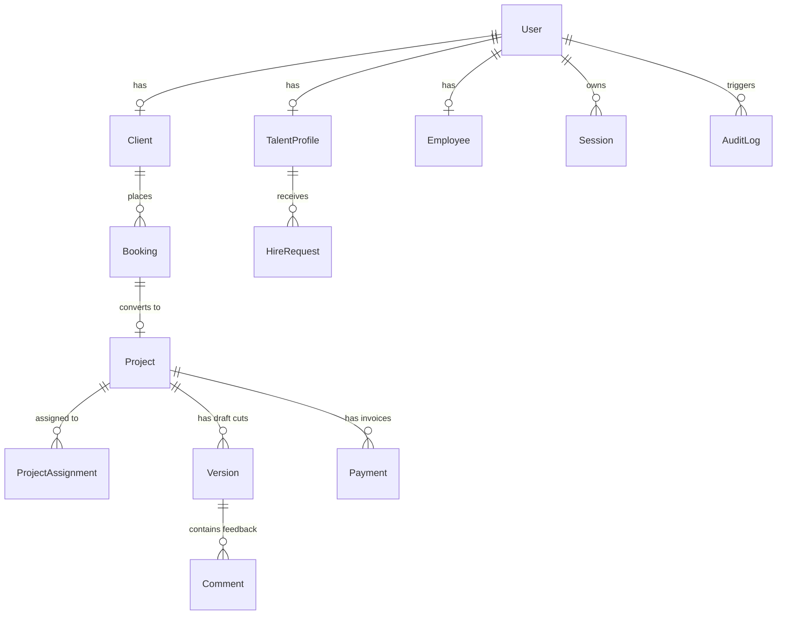

# MDMS (Media & Digital Management System) — Codebase Structure & Architecture Analysis Report

> **Project:** MDMS — MP Production  
> **Repository Type:** Turborepo Monorepo  
> **Generated Date:** July 2026  
> **Scope:** Full-stack Architecture, Roles & Permissions, Functionalities, Tech Stack, Database Schema, and Directory Mapping.

---

## 1. System Overview & Executive Summary

**MDMS (Media & Digital Management System)** is an enterprise-grade digital media, talent booking, post-production management, and content ecosystem built for **MP Production**. 

The system serves as a unified digital hub for managing:
- **Public Brand & Media Presence:** High-performance, cinematic public pages showcasing portfolios, blogs, team members, services, and talent directories.
- **Talent Onboarding & Management:** Registration wizards, comp card generators, showreel management, and booking inquiry pipelines for models, actors, and creators.
- **Client Project Tracking:** Client portals for project tracking, video proofing with frame-accurate commenting, quotation acceptance, and online payment processing.
- **Editor & Production Workflows:** Specialized portals for video editors and project managers to manage rendering pipelines, asset uploads, and milestone revisions.
- **Administrative Control & Governance:** Role-Based Access Control (RBAC), user deactivation, MFA management, detailed audit logging, and dynamic CMS management.

---

## 2. Technology Stack

### 2.1 Monorepo & Infrastructure
- **Monorepo Engine:** [Turborepo](https://turbo.build/) (v2+) with [pnpm Workspaces](https://pnpm.io/)
- **Containerization:** Docker (`docker-compose.yml` for dev, `docker-compose.prod.yml` for prod)
- **Deployment Environments:** Vercel (Frontend Next.js), Render / Node.js Server (Backend NestJS API), Supabase / Managed PostgreSQL.

### 2.2 Backend Application (`/apps/api`)
- **Framework:** NestJS 10+ (Node.js framework)
- **Language:** TypeScript (Strict Mode)
- **Database Access / ORM:** Prisma ORM 5+ with PostgreSQL
- **Caching & In-Memory Storage:** Redis (`ioredis` / NestJS Cache Module)
- **Validation & Serialization:** `class-validator` & `class-transformer` for strict DTO payload verification
- **Authentication & Security:** `@nestjs/jwt`, `passport-jwt`, `@Roles()` and `@Public()` decorators, bcrypt password hashing.

### 2.3 Frontend Application (`/apps/web`)
- **Framework:** Next.js 15 (App Router) with React 19
- **Styling:** Vanilla CSS design tokens (`@mdms/design-tokens`) + Tailwind CSS + `next-themes` (Dark/Light mode support)
- **Animations:** Framer Motion, GSAP (GreenSock Animation Platform) for high-end cinematic interactions
- **Icons & UI:** `lucide-react`, Custom Glassmorphic components
- **Auth Client:** NextAuth / Custom Supabase Auth integration (`@supabase/ssr`)

### 2.4 Shared Monorepo Packages (`/packages`)
- **`@mdms/types`:** Centralized TypeScript enums (`Role`, `ProjectStatus`, `BookingStatus`, etc.), API response types, and authentication interface definitions.
- **`@mdms/design-tokens`:** CSS tokens defining design system variables (Warm Ivory light theme, Midnight Navy dark theme).
- **`@mdms/config`:** Shared TSConfig base configurations across sub-packages.

### 2.5 Integrations & Services
- **Payment Gateway:** Razorpay API (Order creation, signature verification, webhooks)
- **Cloud Storage:** Supabase Storage & Cloudinary (Media assets, video clips, comp cards)
- **Communication:** WhatsApp Business API integration (Template messages) & SMTP Email (Nodemailer / OTP delivery)

---

## 3. Directory Structure Mapping

```
MP Production/
├── apps/
│   ├── api/                    # NestJS Backend API (Global Prefix: /api/v1)
│   │   ├── src/
│   │   │   ├── admin/          # RBAC, User Management, MFA Resets
│   │   │   ├── audit/          # System Audit Logger Service & Controllers
│   │   │   ├── auth/           # Login, Register, Password/OTP/MFA flows
│   │   │   ├── booking/        # Public & Client booking request engines
│   │   │   ├── client/         # Client profile and project dashboard services
│   │   │   ├── cms/            # CMS engine (Blog, Portfolio, Testimonials, Team, FAQs)
│   │   │   ├── common/         # Guards (JwtAuthGuard, RolesGuard), Decorators, Maps
│   │   │   ├── editor/         # Editor assignment and version review logic
│   │   │   ├── employee/       # Staff tasks, leaves, and attendance
│   │   │   ├── file/           # Cloud upload presigned URL generator
│   │   │   ├── health/         # System status & diagnostic check endpoints
│   │   │   ├── notifications/ # Email and in-app alert dispatcher
│   │   │   ├── payments/       # Razorpay order & webhook processing
│   │   │   ├── prisma/         # Prisma client service injection
│   │   │   ├── projects/       # Core project management lifecycle
│   │   │   ├── redis/          # Redis service wrapper for token & rate limit cache
│   │   │   ├── system/         # Platform environment configs
│   │   │   ├── talent/         # Talent profile management & search indexing
│   │   │   ├── whatsapp/       # WhatsApp API logs & webhooks
│   │   │   ├── app.module.ts   # Root Module registering global guards & features
│   │   │   └── main.ts         # App bootstrapper with ValidationPipe & Swagger/Prefix
│   │   └── package.json
│   │
│   └── web/                    # Next.js 15 App Router Frontend
│       ├── src/
│       │   ├── app/
│       │   │   ├── (auth)/     # Public Auth routes (/login, /register)
│       │   │   ├── (protected)/# Protected Portal Routes by Role
│       │   │   │   ├── admin/             # Admin Management Dashboard
│       │   │   │   ├── super-admin/       # Super Admin Control Center
│       │   │   │   ├── client-portal/     # Client Workspace & Proofing
│       │   │   │   ├── talent-dashboard/  # Talent Profile & Booking Portal
│       │   │   │   ├── editor-portal/     # Video Editor Project Hub
│       │   │   │   ├── employee-portal/   # Employee Portal
│       │   │   │   └── project-manager/   # Project Manager Dashboard
│       │   │   ├── about/      # Public About Us page
│       │   │   ├── portfolio/  # Public Portfolio Showcase
│       │   │   ├── talent/     # Public Talent Directory & Profile view
│       │   │   ├── blog/       # Public Blog articles
│       │   │   ├── page.tsx    # Cinematic Landing Homepage
│       │   │   └── layout.tsx  # Global Root Layout with Providers
│       │   ├── components/     # UI, Motion, and Portal Layout Components
│       │   ├── middleware.ts   # Server-side Route Guard validating JWT & Roles
│       │   └── auth.ts         # NextAuth / Session context handlers
│       └── package.json
│
├── packages/
│   ├── types/                  # @mdms/types — Shared Enums, DTOs, Permissions Map
│   ├── design-tokens/          # @mdms/design-tokens — CSS variables & themes
│   └── config/                 # Common TSConfig presets
│
├── prisma/
│   ├── schema.prisma           # Primary PostgreSQL Data Model Schema
│   ├── seed.ts                 # Database Seeding Script
│   └── migrations/             # SQL Migration History
│
├── AGENTS.md                   # AI Developer Build & Rule Specs
├── CODEBASE_MAP.md             # Developer File Mapping Reference
├── docker-compose.yml          # Local Postgres & Redis container setups
├── package.json                # Monorepo root workspace configuration
├── pnpm-workspace.yaml         # Workspace definition file
└── turbo.json                  # Turborepo build pipeline config
```

---

## 4. User Roles & Access Control Matrix (RBAC)

The platform enforces strict 8-tier Role-Based Access Control (RBAC). User roles are defined in `Role` enum (`packages/types/src/index.ts`):

| Role Identifier | Description & Access Level | Dashboard Route Scope | Key Permissions |
| :--- | :--- | :--- | :--- |
| **`GUEST`** | Unauthenticated visitors | Public Pages (`/`, `/about`, `/portfolio`, `/talent`, `/blog`, `/services`) | View public media, search talent directory, submit contact & talent application forms. |
| **`CLIENT`** | External clients & brand partners | `/client-portal` | Create project briefs, view project progress, review video cuts, place timestamps/comments, approve quotes, pay invoices via Razorpay. |
| **`TALENT`** | Actors, models, crew, influencers | `/talent-dashboard` | Manage portfolio/bio, upload comp cards & showreels, update availability, respond to hire requests, track earnings/expenses. |
| **`EDITOR`** | Video editors & post-production staff | `/editor-portal` | Access assigned project files, upload video render versions, view client revision requests, mark milestone progress. |
| **`EMPLOYEE`** | Internal team members & staff | `/employee-portal` | View assigned task boards, request leave/attendance, log work hours, submit expense claims. |
| **`PROJECT_MANAGER`** | PMs overseeing client deliverables | `/project-manager` | Assign editors & talent to projects, manage timeline schedules, review client comments, generate quotes. |
| **`ADMIN`** | Operations Administrators | `/admin` | Manage user accounts, elevate roles up to `ADMIN`, manage CMS (blogs, portfolios, testimonials), view audit logs, process talent applications. |
| **`SUPER_ADMIN`** | Platform Owners & Super Admins | `/super-admin` | Full system access: elevate users to `SUPER_ADMIN`, reset user MFAs, purge recycle bin, update global site variables, view full system audits. |

---

## 5. Core Platform Functionalities & Feature Modules

### 5.1 Authentication & Security Architecture
- **JWT & Session Management:** Access tokens accompanied by refresh tokens stored securely.
- **Next.js Route Middleware (`middleware.ts`):** Validates incoming requests against role-restricted prefix rules (`ROLE_ROUTES`), instantly redirecting unauthorized users.
- **NestJS Global Guards:** `JwtAuthGuard` paired with `RolesGuard` applied across all API routes in `app.module.ts`. Routes marked with `@Public()` bypass authentication; all others strictly enforce role checks via `@Roles(...)`.
- **OTP & MFA:** Email-based OTP verification and TOTP Authenticator app integration.

### 5.2 Client & Booking Portal
- **Quotation & Service Inquiries:** Clients can request custom project quotes with specific service add-ons.
- **Video Proofing System:** Interactive video player in `/client-portal` allowing clients to play video cuts, add timestamped feedback notes, request revisions, or issue final approval (`APPROVED`, `REVISION_REQUESTED`).
- **Billing & Invoicing:** Seamless checkout with Razorpay integration supporting advance payments, milestone settlements, and GST-compliant automated invoicing.

### 5.3 Talent Management Engine
- **Public Directory & Filtering:** High-performance searchable talent catalog with filters for category, experience level, physical attributes, location, and availability.
- **Onboarding Wizard:** Step-by-step registration wizard (`/join/talent`) capturing bio, social media links, experience, brand history, comp cards, and video intros.
- **Comp Card & Showreel Hosting:** Media asset pipeline supporting PDF comp cards, image galleries, and video showreels stored in cloud buckets.

### 5.4 Video Production & Editor Workflow
- **Project Allocation:** Project Managers assign specific video editors (`ProjectAssignment`) to projects.
- **Version Control:** Editors upload iterative draft versions (`Version`), tracking status transitions (`UPLOADED` → `IN_REVIEW` → `APPROVED` / `REVISION_REQUESTED`).
- **Render Jobs:** Tracking background rendering jobs (`RenderJob`) with status reporting (`QUEUED`, `PROCESSING`, `DONE`, `FAILED`).

### 5.5 Content Management System (CMS)
- **Dynamic Blog Engine:** Full rich-text post editor supporting status scheduling (`DRAFT`, `PUBLISHED`, `SCHEDULED`, `ARCHIVED`), tags, and SEO slugs.
- **Portfolio Showcase:** Project showcases with embedded videos, category tags, client attribution, and sort ordering.
- **Testimonials & Team Directories:** Client reviews moderation dashboard and team directory management.
- **Global Site Configuration:** Centralized key-value site variables table (`SystemConfig`) controlling brand contact info, social links, and banner announcements.

### 5.6 Governance, Audit & Utility Services
- **Audit Logging (`AuditLog`):** Automated tracking of key system actions (login attempts, role modifications, account deactivations, MFA resets) recording `actorId`, `action`, `ipAddress`, and `metadata`.
- **Soft-Delete Recycle Bin (`RecycleBin`):** Deleted database entities are staged in a recycle bin for recovery before permanent purging by a `SUPER_ADMIN`.
- **WhatsApp Automation (`WhatsAppLog`):** Outbound WhatsApp template notification service for instant order confirmations, payment receipts, and project updates.

---

## 6. Database Architecture & Primary Data Models

The database schema (`prisma/schema.prisma`) is modeled in **PostgreSQL 15+** with Prisma ORM:



### Key Models Summary
1. **`User`**: Base user credentials, auth parameters (`role`, `passwordHash`, `isActive`, `mfaEnabled`, `lockedUntil`).
2. **`Client`**: Extended details for corporate clients (company name, GSTIN, lifetime spend value).
3. **`TalentProfile`**: Talent portfolio details (slug, stage name, experience, comp card URLs, onboarding status).
4. **`Employee`**: Staff profile records (department, designation, join date, salary details).
5. **`Booking` & `Project`**: Work lifecycle tracking from inquiry (`INQUIRY`) to project execution (`SHOOT`, `EDITING`, `DELIVERED`, `COMPLETED`).
6. **`Version` & `Comment`**: Post-production media cuts with timestamped feedback.
7. **`Payment`**: Razorpay transaction logs (orders, payment IDs, signatures, amounts, payment type).
8. **`AuditLog` & `RecycleBin`**: Enterprise compliance and safety tracking.

---

## 7. Verification & Build Workflow

To ensure stability across the monorepo, the codebase adheres to strict build verification standards:

1. **Backend Build Check:**
   ```bash
   pnpm --filter api build
   ```
2. **Frontend Build Check:**
   ```bash
   pnpm --filter web build
   ```
3. **Shared Types Check:**
   ```bash
   pnpm --filter @mdms/types build
   ```
4. **Database Migration Workflow:**
   ```bash
   pnpm prisma migrate dev --name <migration-name>
   ```

---

## 8. Summary & Conclusion

The MDMS monorepo represents a robust, highly modular architecture built with modern TypeScript technologies. The separation of concerns between shared type definitions (`@mdms/types`), a NestJS REST API (`apps/api`), and a Next.js App Router frontend (`apps/web`) ensures maintainability, strict type safety, and seamless role-gated user experiences for clients, talent, video editors, and administrators.
